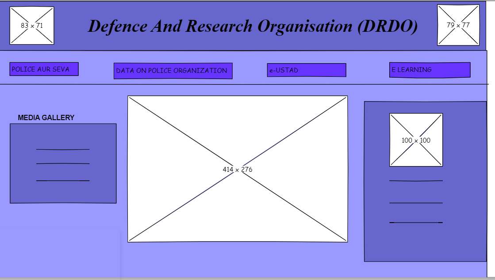

# Wire frame for a website

## AIM:
To design a wire frame for a website.

## DESIGN STEPS:

### Step 1:
resize the canvas as per the requirement.

### Step 2:
add a box assuming the head part of the page and logo images in it.

### Step 3:
add a box with buttons as a navigation buttons.

### Step 4:
add a table and a calender.

### Step 5:
add a text for home page and about us page and for photo gallery page add image boxes.

## OUTPUT:

## Result:
Thus a wire frame is designed for a given website.
